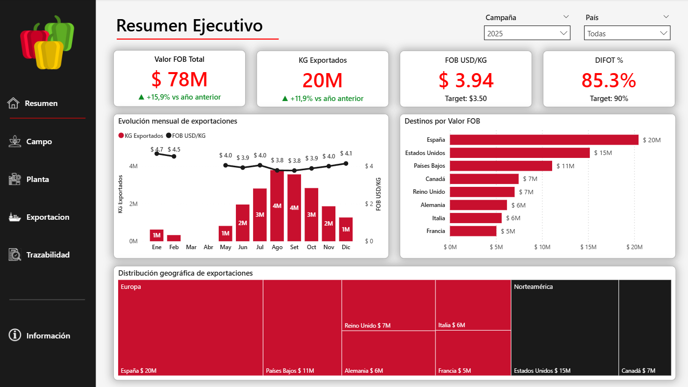
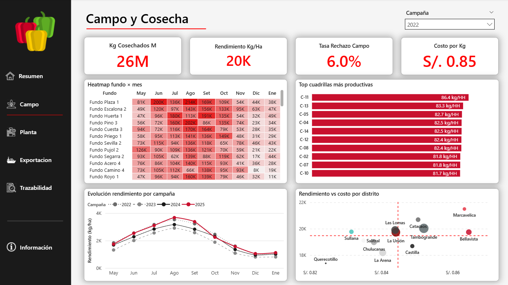
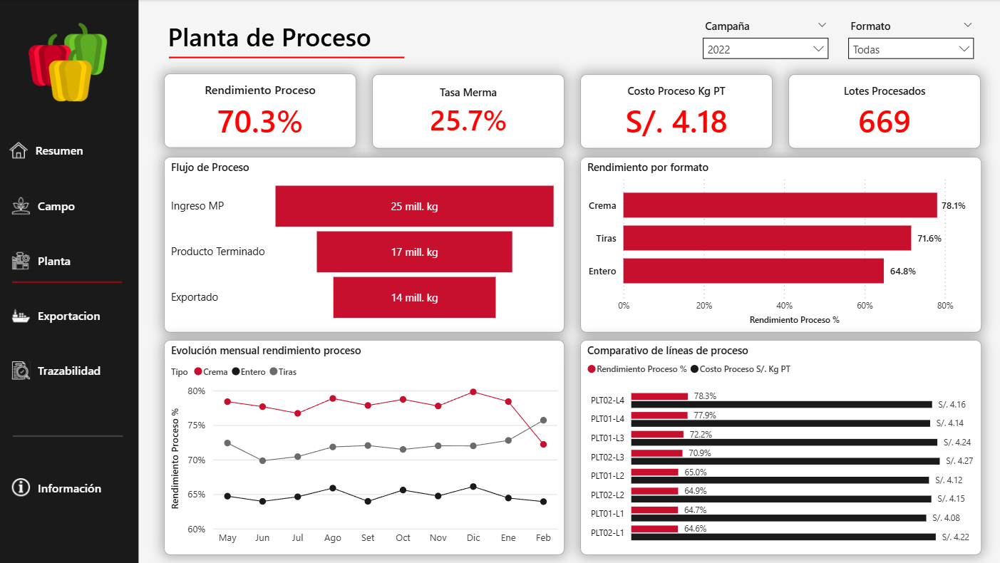
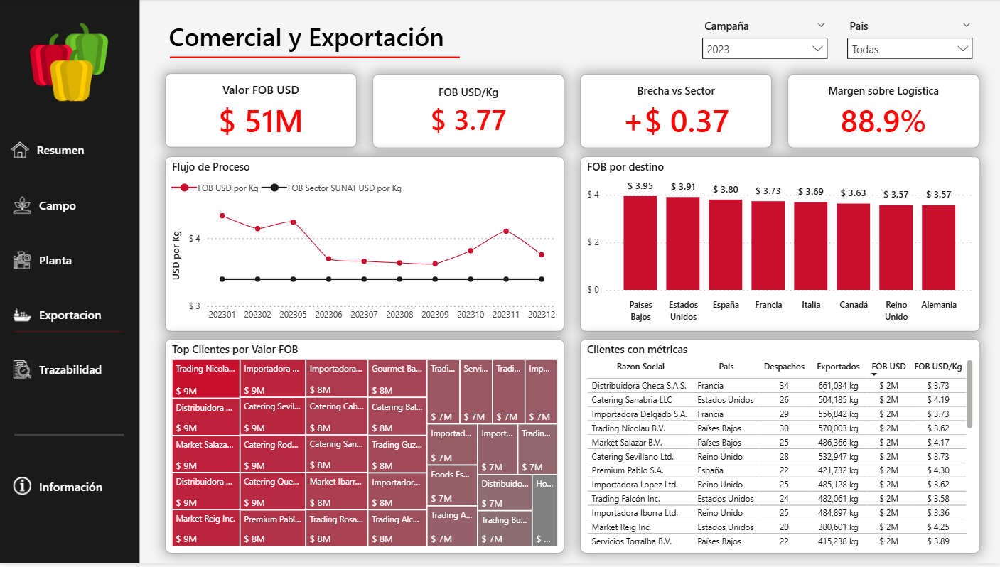
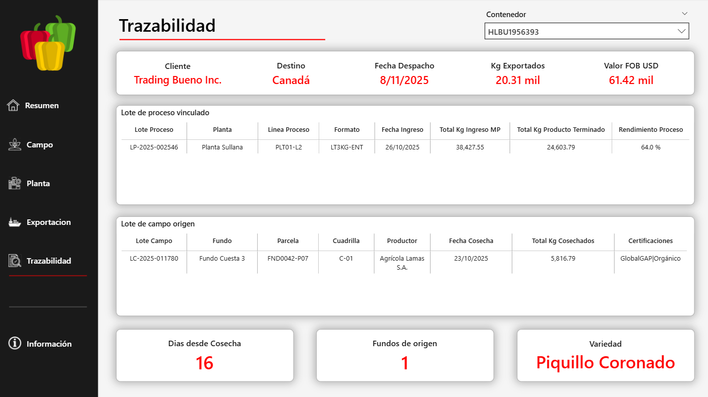

# Piquillo BI — Plataforma de Análisis Agroindustrial

> Plataforma de Business Intelligence end-to-end para una agroexportadora peruana ficticia, dedicada a la exportación de **pimiento piquillo en conserva**. Implementa el ciclo completo desde generación de datos sintéticos hasta dashboard interactivo en Power BI, con SQL Server como motor del datawarehouse.


---

## Contexto del proyecto

Perú es el **primer exportador mundial de pimiento piquillo en conserva** (partida arancelaria 2005.99.10.00), con Piura concentrando la producción. Este proyecto modela las operaciones completas de **AgroPiura Conservas S.A.C.** (empresa ficticia con sede en Sullana, Piura), abarcando 4 campañas (2022-2025) desde la cosecha en campo hasta el despacho FOB al cliente final.

**Pregunta de negocio principal:**

> *¿Qué tan eficiente es nuestra cadena de valor desde el campo hasta el contenedor exportado, y dónde se está perdiendo margen operativo y comercial?*

El dashboard responde a tres ejes de análisis: eficiencia agrícola e industrial, performance comercial, y trazabilidad operativa.

---

## Stack técnico

| Capa | Herramienta |
|---|---|
| **Generación de datos** | Python 3.11 (pandas, numpy, faker) |
| **Almacenamiento** | SQL Server 2019 Developer Edition |
| **Modelado dimensional** | Schema Kimball star (3 hechos + 13 dimensiones, 2 con SCD2) |
| **ETL** | Stored Procedures con orquestación maestra + audit log |
| **Capa semántica** | Views SQL en schema `rpt` |
| **Análisis y visualización** | Power BI Desktop con Tabular Editor 2 |
| **Lenguaje de medidas** | DAX (32 medidas organizadas en 5 carpetas) |
| **Seguridad** | Row-Level Security con 3 roles (Gerencia / Comercial / Operaciones) |
| **Control de versiones** | Git + GitHub |

---

## Arquitectura

```
┌─────────────┐    ┌──────────┐    ┌─────────────┐    ┌──────────┐
│   Python    │───►│   CSVs   │───►│ SQL Server  │───►│ Power BI │
│ Generación  │    │  Raw     │    │   DW        │    │Dashboard │
│  sintética  │    │ (~19k    │    │             │    │ 5 pages  │
│             │    │  filas)  │    │ stg → dw    │    │ + RLS    │
│ +Datos      │    │          │    │ → rpt views │    │          │
│  SUNAT      │    │          │    │             │    │          │
└─────────────┘    └──────────┘    └─────────────┘    └──────────┘
```

**Schemas del datawarehouse:**

- `stg` — Staging crudo (NVARCHAR, tolerancia a errores de CSV)
- `dw` — Modelo dimensional tipado (star schema Kimball)
- `audit` — Log de ejecuciones del ETL
- `rpt` — Vistas semánticas para Power BI

---

## Modelo dimensional

### Tablas de hechos

| Hecho | Granularidad | Filas aprox. |
|---|---|---|
| `FactCosecha` | Día × Fundo × Parcela × Cuadrilla | ~13,000 |
| `FactProceso` | Lote de proceso en planta | ~2,700 |
| `FactDespacho` | Contenedor exportado | ~3,400 |

### Dimensiones (13)

`DimFecha`, `DimProductor` (SCD2), `DimFundo`, `DimParcela`, `DimCuadrilla`, `DimPlanta`, `DimLineaProceso`, `DimFormato`, `DimCliente`, `DimDestino`, `DimNaviera`, `DimIncoterm`, `DimPrecioRefSUNAT` (SCD2)

### Implementación SCD Tipo 2

`DimProductor` mantiene el historial de cambios de categoría (Pequeño/Mediano/Grande) y certificaciones (GlobalGAP, SMETA, BRC, Orgánico) a lo largo de las campañas. El lookup de `ProductorSK` en `FactCosecha` se resuelve por la fecha del evento:

```sql
INNER JOIN dw.DimProductor p
    ON p.ProductorID = s.ProductorID
   AND CAST(s.FechaCosecha AS DATE) BETWEEN p.FechaInicio AND p.FechaFin
```

`DimPrecioRefSUNAT` mantiene precios FOB referenciales del sector mes a mes, permitiendo comparar nuestro precio vs el promedio del mercado peruano.

---

## Páginas del dashboard

### 1. Resumen Ejecutivo
Audiencia: Gerencia General. KPIs hero (Valor FOB, Kg Exportados, FOB USD/Kg, DIFOT %) con variación interanual, evolución mensual, ranking de destinos, distribución geográfica por región.

### 2. Campo y Cosecha
Audiencia: Jefe de Producción Agrícola. Heatmap fundo × mes, top cuadrillas por productividad, evolución del rendimiento por campaña (visible el impacto del Niño Costero 2023), análisis rendimiento vs costo por distrito.

### 3. Planta de Proceso
Audiencia: Jefe de Planta. Flujo de proceso (MP → PT → Exportado), rendimiento por tipo de formato (Entero/Tiras/Crema), evolución mensual, comparativo de líneas de proceso con costo y rendimiento.

### 4. Comercial y Exportación
Audiencia: Gerente Comercial. FOB nuestro vs precio referencial SUNAT, comparativo por destino, top clientes con métricas detalladas, brecha de margen.

### 5. Trazabilidad
Audiencia: Calidad y Aseguramiento. Drill desde contenedor exportado hasta lote de campo, productor y certificaciones. Implementado mediante vista SQL aplanada (`rpt.vw_TrazabilidadCompleta`) para optimizar el caso de uso de drill-down.

---

## Realismo de dominio

El dataset sintético respeta las características reales del cultivo y procesamiento del piquillo en Piura:

- **Estacionalidad bimodal:** campaña principal Mayo-Octubre (peak agosto-septiembre), mini-campaña noviembre-enero
- **Factor climático:** rendimiento reducido en 2023 por el Niño Costero
- **Curva de edad de plantación:** pico de rendimiento entre 3-5 años, declive posterior
- **Rendimientos industriales por tipo:** Entero ~65%, Tiras ~72%, Crema ~78%
- **Distribución de destinos:** Europa concentra ~62% (España como #1), USA ~20%
- **Formatos típicos:** frasco 314 ml, lata 200g, lata 3 kg foodservice, pouch 500 g
- **Pricing premium por certificación:** GlobalGAP +5%, Orgánico +18%, BRC +5%

---

## Estructura del repositorio

```
piquillo-bi-platform-peru/
├── python/                       # Generador de datos sintéticos
│   ├── orchestrator.py            # Script maestro
│   ├── config.yaml                # Configuración de parámetros
│   ├── generators/                # Generadores por tabla
│   └── notebooks/                 # Validación QA
│
├── sql/                          # Datawarehouse SQL Server
│   ├── 00_database/               # Creación de BD
│   ├── 01_schemas/                # Schemas stg, dw, audit, rpt
│   ├── 02_staging/                # Tablas staging
│   ├── 03_dimensions/             # 13 dimensiones (2 SCD2)
│   ├── 04_facts/                  # 3 tablas de hechos
│   ├── 05_indexes/                # Índices nonclustered
│   ├── 06_stored_procedures/      # SPs de carga (5)
│   ├── 07_views/                  # Vistas semánticas rpt.*
│   ├── 08_audit/                  # Audit log
│   ├── 99_deploy_all.sql          # Despliegue automático
│   └── 99_validacion_post_etl.sql # Queries de validación
│
├── powerbi/                      # Dashboard
│   ├── piquillo-bi.pbix           # Archivo Power BI
│   ├── theme/                     # Tema custom JSON
│   └── tabular_editor_scripts/    # Scripts C# para crear medidas
│
└── data/
    └── samples/                  # Muestras públicas (10%)
```

---

## Capturas del dashboard

### 1. Resumen Ejecutivo


### 2. Campo y Cosecha


### 3. Planta de Proceso


### 4. Comercial y Exportación


### 5. Trazabilidad


## Cómo desplegar

### Requisitos

- Python 3.11+
- SQL Server 2019+ (Developer Edition es gratis)
- SQL Server Management Studio (SSMS)
- Power BI Desktop
- Tabular Editor 2 (gratuito, para las medidas DAX)

### Pasos

1. **Generar datos sintéticos:**
   ```bash
   cd python
   python -m venv .venv
   .venv\Scripts\activate
   pip install -r requirements.txt
   python orchestrator.py
   ```

2. **Desplegar el datawarehouse:**
   - Abrir `sql/99_deploy_all.sql` en SSMS
   - Activar SQLCMD Mode (menú Query → SQLCMD Mode)
   - Ejecutar (F5)

3. **Cargar los datos:**
   ```sql
   EXEC dw.usp_RunMasterETL
       @DataPath = N'C:\ruta\a\proyecto\data\raw\',
       @ModoSCD2 = N'FULL';
   ```

4. **Abrir el dashboard:**
   - Abrir `powerbi/piquillo-bi.pbix` en Power BI Desktop
   - Refrescar contra tu instancia local de SQL Server

---

## Decisiones técnicas relevantes

| Decisión | Razón |
|---|---|
| Schema `stg` con NVARCHAR para todo | Los CSV nunca fallan al cargar; validación/conversión al pasar a `dw` |
| Surrogate key con SCD2 en DimProductor | Soporta historia de cambios de categoría y certificaciones por campaña |
| Computed columns persisted en hechos | Cálculos pre-almacenados (rendimiento, FOB unitario, etc.), Power BI los lee sin recalcular |
| `READ_COMMITTED_SNAPSHOT ON` | Evita lecturas bloqueadas durante cargas concurrentes |
| Audit log con BatchID único por corrida | Trazabilidad operativa del ETL, debugging facilitado |
| Vista aplanada para trazabilidad | Optimiza el caso de uso de drill-down evitando relaciones inter-hecho |
| Modo Import en Power BI | Portabilidad del .pbix, performance Vertipaq |

---

## Sobre los datos

**El dataset es 100% sintético.** Las cifras, productores, fundos, clientes y contenedores son ficticios, generados con `faker` y `numpy` siguiendo distribuciones realistas del dominio. Los parámetros de generación están en `python/config.yaml` y son completamente reproducibles vía la semilla aleatoria (`random_seed: 42`).

Los precios FOB referenciales (`DimPrecioRefSUNAT`) están inspirados en rangos públicos de exportación peruana publicados por SUNAT y ADEX, pero no son los datos exactos.

---

## Autor

**Alexis Zapata** — Analista BI con 5+ años de experiencia en agroindustria peruana. Basado en Marcavelica, Sullana, Piura.

- GitHub: [@szkad](https://github.com/szkad)
- Stack: Power BI, Excel, Power Query, SQL Server, Python, DuckDB, Parquet, DAX, Tabular Editor, Prophet

---

## Licencia

Proyecto de portafolio personal. El código está disponible para fines educativos y de referencia profesional.
